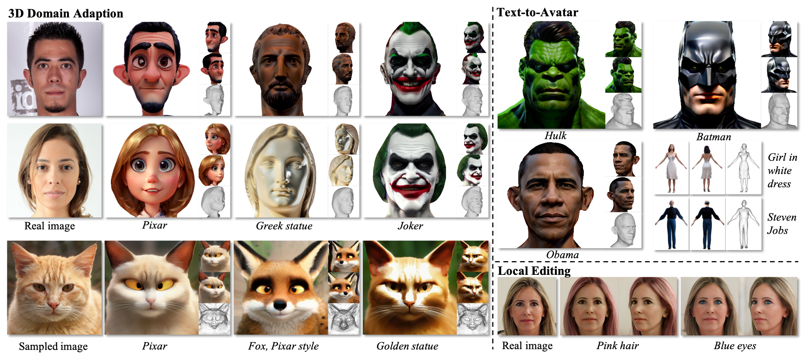

# DiffusionGAN3D

### [Project](https://younglbw.github.io/DiffusionGAN3D-homepage/) | [Paper](https://arxiv.org/abs/2312.16837)


This repository is the official implementation of [DiffusionGAN3D](https://arxiv.org/abs/2312.16837).


> **[DiffusionGAN3D: Boosting Text-guided 3D Generation and Domain Adaptation by Combining 3D GANs and Diffusion Priors](https://arxiv.org/abs/2312.16837)** </br>
> Biwen Lei, Kai Yu, Mengyang Feng, Miaomiao Cui, Xuansong Xie</br>
> In CVPR 2024</br>
> Alibaba Group, Hangzhou, China



DiffusionGAN3D is a novel two-stage framework, which aims to boost the performance of 3D domain adaption and text-to-avatar tasks by combining 3D generative models and diffusion priors.


## Contact
If you have any questions, please contact Biwen Lei (biwen1996@gmail.com).

## Citation
If you use our work in your research, please cite our publication:
```
@misc{lei2023diffusiongan3d,
      title={DiffusionGAN3D: Boosting Text-guided 3D Generation and Domain Adaption by Combining 3D GANs and Diffusion Priors}, 
      author={Biwen Lei and Kai Yu and Mengyang Feng and Miaomiao Cui and Xuansong Xie},
      year={2023},
      eprint={2312.16837},
      archivePrefix={arXiv},
      primaryClass={cs.CV}
}
```

